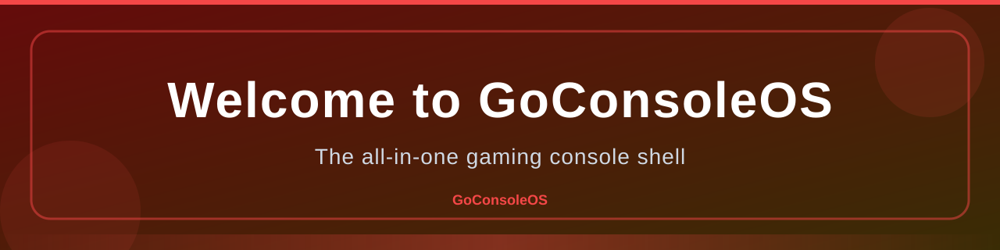
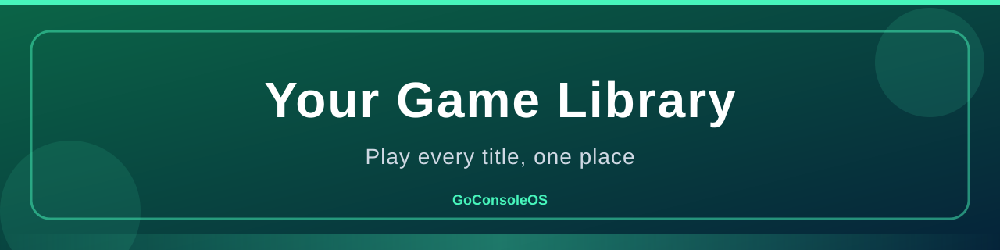
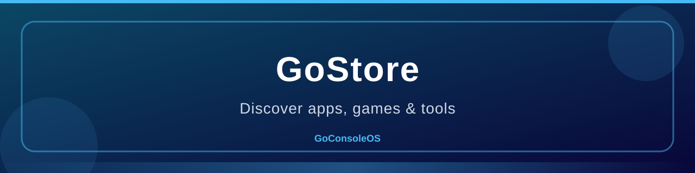
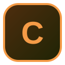
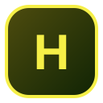
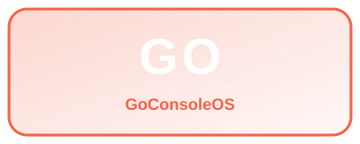
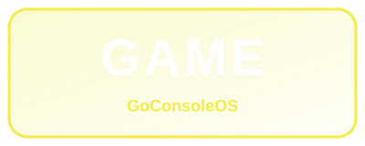
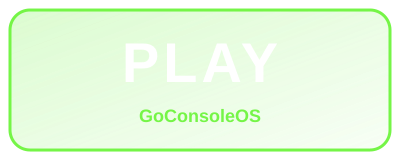

# GoConsoleOS



**GoConsoleOS** is a fast, modern, controller-first gaming console shell for Windows. Built with WPF and .NET 8, it turns any PC into a living-room console.


---

## ✨ Features

- 🎮 **Controller-first UI** — navigate everything with a gamepad; mouse emulation built in
- 🛒 **GoStore** — curated games & apps with one-click download and launch (43+ items)
- 🏆 **Achievements** — persistent unlock tracking with toast notifications
- 🎵 **GoAudio** — Xbox + PS5 inspired procedural sound engine (13+ sounds)
- 💾 **Backup & Restore** — profiles, screenshots, wishlist, settings and game saves
- 🖥️ **True fullscreen mode** — borderless, boot straight into fullscreen
- 🎨 **Themes & accent colors** — 8 preset accents + custom color picker
- 🌙 **Night mode** — dim the whole experience
- 🐎 **Performance modes** — Balanced / Power / Battery Saver
- 👤 **Multi-user profiles** — everyone gets their own space
- 🔌 **Controller vibration, wallpapers, screenshots, network test, guides and more**

## 📦 Getting Started

### Option A — Use the release build (recommended)

1. Download the latest build from the **[Releases page](https://github.com/GoStudios-Real/GoConsoleOS/releases)** (e.g. `GoConsoleOS-v1.0.0-win-x64.zip`).
2. Extract the zip to any folder (for example `D:\`).
3. Run `GoConsoleOS.exe`.
4. On first boot, the console creates its `system` and `profiles` folders next to the exe.

### Option B — Run the raw binaries

The `release/` folder contains `GoConsole.exe`, `GoConsole.dll` and `GoConsoleOS.Shared.dll`.

- Requires the **[.NET 8 Desktop Runtime](https://dotnet.microsoft.com/en-us/download/dotnet/8.0)** for Windows x64.
- Extract them to a folder, copy `catalog.json` from this repo into `plugins\store\`, then run `GoConsole.exe`.

### Option C — Build from source

```powershell
git clone https://github.com/GoStudios-Real/GoConsoleOS.git
cd GoConsoleOS
dotnet publish src/GoConsole/GoConsole.csproj -c Release -r win-x64 --self-contained true -o boot
```

Run `boot\GoConsole.exe`.

## 🕹️ Controls

| Action | Input |
|--------|-------|
| Navigate | D-Pad / Left Stick / Mouse |
| Select / A | Enter or controller A |
| Back / B | Escape or controller B |
| Open menu | Menu button / Right-click |
| Screenshot | `PrintScreen` / controller Capture |
| Night mode | Toggle in Settings |

## 📁 Folder Layout (created on first run)

```
<install dir>/
├── GoConsoleOS.exe        # main app
├── GoConsoleOS.dll        # core assemblies
├── system/                # settings, achievements, logs, sounds, saves, backups
├── profiles/              # per-user data
├── plugins/               # store catalog, hooks, services
├── launcher/              # installed game library
└── runtimes/              # runtime support
```

## 🗂️ Repository Layout

```
├── release/          # raw binaries (GoConsole.exe + DLLs)
├── assets/           # 50 banners, 50 icons, 50 logos
├── catalog.json      # GoStore catalog (43 items)
└── src/              # source code (see the source branch / release zip)
```

## 🗃️ Asset Library

The repo ships **50 banners, 50 icons and 50 logos** for the console. A quick preview:




| | | |
|---|---|---|
|  |  |  |
|  |  |  |

Browse the full set in [`assets/`](assets/).

## 🛡️ Security Notes

- The store only downloads from the verified URLs listed in `catalog.json`.
- Backups are stored locally on your machine.
- This project is for personal use and learning.

## 🏷️ Version

**Current:** v1.0.0 — build date 2026-08-02.

---
*© 2026 GoStudios — GoConsoleOS. All assets generated for the project.*
