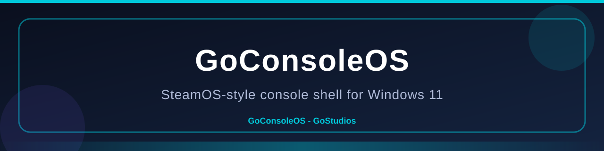
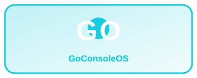

# GoConsoleOS — SteamOS-Style Console UX for Windows 11

<p align="center">
  
  <br/>
  
</p>

**GoConsoleOS** transforms any Windows 11 PC into a living-room console experience — inspired by SteamOS and Steam Big Picture. It runs entirely from a **portable USB drive**, leaving the host Windows installation untouched.

Built by **GoStudios**.

---

## Features

- **Fullscreen Console Shell** — immersive, controller-first UI that hides the Windows desktop
- **Controller-First Input** — native XInput support, mouse emulation, on-screen keyboard
- **Game Library** — scans and aggregates games from Steam, Epic Games, Xbox/Game Pass, GOG, and custom EXEs
- **GoStore** — browse and install themes, plugins, overlays, and controller layouts
- **Performance Modes** — Quiet, Balanced, Turbo with Windows power plan integration
- **In-Game Overlay** — FPS counter, system stats, performance mode switcher (triggered by Guide button)
- **Multi-Profile Support** — per-user profiles with achievements, playtime tracking, favorites
- **Built-in Server (port 39210)** — every console hosts its own HTTP server with the **ACC** (Account Center) REST API + a web dashboard, reachable from any browser on your LAN
- **ACC Account System** — register/sign in, profiles, devices, security (2FA), GoPoints wallet, subscriptions, friends, activity
- **GoConsole Game Pass** — subscribe to Pro / Plus / Premium / Ultimate tiers by day, month or year, or redeem gift card codes (`GC-XXXX-XXXX-XXXX`) generated on the console or the ACC web portal
- **Console Map** — the ACC dashboard plots where your USB consoles and devices are right now (IP-based, privacy aware)
- **GoAI Gaming Assistant** — an on-console AI that answers questions about your library, recommends games, and helps with USB health / performance (press **GOAI** in the nav bar)
- **Portable USB Gaming Console** — the server and GoAI run from the USB drive, no cloud required
- **Fully Portable** — runs from USB, no Windows installation modifications

---

## Folder Structure

```
X:\GoConsoleOS\              (X = USB drive letter)
├── boot\                    Boot files
│   ├── gocore.exe           Core boot service
│   ├── init.cfg             Boot configuration
│   └── splash.png           Boot splash image
├── launcher\                Main shell
│   ├── GoConsole.exe        Console shell executable
│   ├── launcher.json        Launcher config
│   ├── home\                Home screen data
│   ├── library\             Game library data
│   │   ├── library.json     Scanned game database
│   │   └── custom\          Custom EXE definitions
│   ├── store\               Store cache
│   ├── settings\            Settings cache
│   └── profiles\            Active profile data
├── profiles\                User profiles
│   ├── user1\               Example user profile
│   ├── user2\               Example user profile
│   └── guest\               Guest profile (no permanent storage)
├── system\                  System services
│   ├── logs\                Application logs
│   ├── cache\               Cached data
│   ├── performance\         Performance profiles
│   │   └── profiles.json    Performance mode definitions
│   ├── services\            Service configurations
│   ├── controller\          Controller mappings
│   ├── ui\                  UI resources
│   └── hooks\               Event hooks
├── apps\                    Add-on applications
│   ├── browser\             Web browser
│   ├── media\               Media player
│   └── tools\               Utility tools
├── plugins\                 Extensible plugins
│   ├── themes\              UI themes
│   ├── extensions\          Functionality extensions
│   ├── overlays\            Custom overlay HUDs
│   └── store\               Store catalog
│       └── catalog.json     Item catalog
├── assets\                  Static assets
│   ├── icons\               Application icons
│   ├── fonts\               Custom fonts
│   ├── sfx\                 Sound effects
│   └── wallpapers\          Background wallpapers
└── src\                     Source code (for development)
    ├── GoConsoleOS.sln      .NET 8 solution file
    ├── GoConsoleOS.Shared\  Shared library
    ├── GoCore\              Boot service (gocore.exe)
    └── GoConsole\           Console shell (GoConsole.exe)
└── web\                     ACC Account Center website (served on port 39210, mirrored to GitHub Pages)
    ├── index.html           Dashboard markup
    ├── acc.css              Styling
    └── acc.js               API client + auth flow
```

---

## Quick Start — Copy to USB

### Prerequisites
- A USB 3.0+ drive with at least **1 GB** free space (500 MB minimum)
- A PC running **Windows 11** (x64)

### Setup

1. **Download the release** or build from source (see Building section below).

2. Copy the **entire `GoConsoleOS` folder** to your USB drive:
   ```
   D:\GoConsoleOS\   →   X:\GoConsoleOS\
   ```
   Replace `D:` with your download location and `X:` with your USB drive letter.

3. **(Optional)** Add a boot splash image:
   - Place a `splash.png` in `X:\GoConsoleOS\boot\`
   - Recommended size: 1920×1080

### Launching GoConsoleOS

**Method 1 — Boot Service (recommended):**
```
X:\GoConsoleOS\boot\gocore.exe
```
This shows the splash screen, initializes services, and launches the console shell.

**Method 2 — Direct Shell:**
```
X:\GoConsoleOS\launcher\GoConsole.exe
```
Skips the boot sequence and directly starts the console shell.

**Method 3 — Auto-start with Windows:**
Create a shortcut to `gocore.exe` or `GoConsole.exe` in:
```
%APPDATA%\Microsoft\Windows\Start Menu\Programs\Startup
```
GoConsoleOS will then start automatically when Windows boots.

### Switching Between Console Mode and Desktop

| Action | Method |
|--------|--------|
| **Return to desktop** | Press `Alt+F4` or close GoConsole.exe |
| **Open system menu** | Press `F9` or controller Start button |
| **Hide overlay** | Press the Guide button again |
| **Close GoConsoleOS** | Press `Alt+F4` on the desktop window |

---

## Controller Mapping

All navigation is designed for an **Xbox controller** (XInput).

| Button | Action |
|--------|--------|
| Left Stick / D-Pad | Move focus |
| A | Select / Confirm |
| B | Back |
| X | Context Menu |
| Y | Search (on-screen keyboard) |
| Start | System Menu |
| Guide (Xbox button) | Toggle In-Game Overlay |
| Right Stick | Mouse emulation cursor |
| Right Trigger | Mouse left click |
| Left Trigger | Mouse right click / Escape |

---

## Keyboard Shortcuts

| Key | Action |
|-----|--------|
| `F1` | Go to Home |
| `F2` | Go to Library |
| `F3` | Go to Store |
| `F5` | Go to Settings |
| `F9` | Toggle Overlay |
| `F11` | Cycle Performance Mode |
| `Escape` | Back to previous view |
| `Alt+F4` | Close GoConsoleOS |
| `Enter` | Select focused item |

---

## Adding Custom Games (Non-Steam)

1. Open `X:\GoConsoleOS\launcher\library\custom\custom_games.json`
2. Add entries following the existing template:

```json
{
  "Id": "custom_mygame_1",
  "Title": "My Game",
  "Platform": "Custom",
  "ExecutablePath": "C:\\Games\\MyGame\\game.exe",
  "WorkingDirectory": "C:\\Games\\MyGame",
  "Genres": ["Action"],
  "Tags": [],
  "IsInstalled": true
}
```

3. Restart GoConsole.exe or rescan from the Library view.

---

## Performance Modes

Three global profiles are available and can be toggled from Settings or via `F11`:

| Mode | Description | Power Plan |
|------|-------------|-----------|
| **Quiet** | Low power, quiet fan. 50% CPU, 60% GPU limit. 30 FPS cap. | Power Saver |
| **Balanced** | Default. Good performance and thermals. 80% CPU/GPU. 60 FPS cap. | Balanced |
| **Turbo** | Max performance. 100% CPU/GPU. Uncapped FPS. | High Performance |

Per-game overrides can be defined in `system/performance/profiles.json`.

---

## Configuration Reference

### `boot/init.cfg`

The main configuration file controls boot behavior, paths, and service settings. All paths are relative to the GoConsoleOS root directory.

Key settings:

| Section | Key | Description | Default |
|---------|-----|-------------|---------|
| `[general]` | `auto_detect_drive` | Auto-detect USB drive path | `true` |
| `[boot]` | `boot_mode` | Boot mode: `shell`, `desktop`, `ask` | `ask` |
| `[boot]` | `auto_launch_shell` | Auto-start GoConsole.exe | `true` |
| `[performance]` | `default_mode` | Default perf mode | `balanced` |
| `[services]` | `xinput_enabled` | Enable Xbox controller support | `true` |
| `[display]` | `fullscreen` | Start in fullscreen mode | `true` |
| `[overlay]` | `enabled` | Enable in-game overlay | `true` |

### `plugins/store/catalog.json`

Defines items available in the GoStore: themes, plugins, overlays, controller layouts, and games.

### `system/performance/profiles.json`

Defines global performance profiles and per-game overrides.

---

## ACC Server & GoAI

Every GoConsoleOS host (desktop USB console **and** the GoConsoleOS Android app) runs a built-in HTTP server on **port 39210**:

| URL | Purpose |
|-----|---------|
| `http://localhost:39210/` | ACC Account Center web dashboard |
| `http://localhost:39210/api/acc/*` | Account REST API (register, login, profile, devices, map, wallet, subscriptions, friends, activity) |
| `http://localhost:39210/api/goai` | GoAI assistant API |
| `http://localhost:39210/api/info` | Console info (name, version, features) |

- Open **SETTINGS → Account** (or the profile name in the top bar) to sign in / open the portal.
- Press **GOAI** in the nav bar to chat with the gaming assistant.
- The **Console map** card on the dashboard shows this console's approximate location (resolved from its public IP) plus every registered device — great for keeping tabs on a portable USB console from your phone.
- The same ACC web site is mirrored on GitHub Pages at
  <https://rhysboxgamestudios.github.io/GoConsoleOS-Web/> (pass `?host=<console-ip>` to point it at a console).
- The Android companion app (`GoConsoleOS-Android`) also hosts the ACC API + GoAI on-device at port 39210.

---

## Building from Source

### Prerequisites

- [.NET 8 SDK](https://dotnet.microsoft.com/download/dotnet/8.0) (any 8.0.x version)
- Windows 11 (x64)

### Build Steps

1. **Clone or copy** the source to a local folder.

2. **Run the build script:**
   ```
   build.bat
   ```
   This restores NuGet packages, builds all projects, and publishes them to the correct output directories.

3. **Or build manually:**
   ```
   cd src
   dotnet restore GoConsoleOS.sln
   dotnet publish GoConsoleOS.Shared -c Release
   dotnet publish GoCore\GoCore.csproj -c Release -o ..\boot
   dotnet publish GoConsole\GoConsole.csproj -c Release -o ..\launcher
   ```

4. **Copy to USB:** Copy the entire `GoConsoleOS` directory to your USB drive.

---

## Architecture Overview

```
┌─────────────────────────────────────────────┐
│              GoConsole.exe                  │
│        (WPF Console Shell UI)               │
│  ┌─────────┐ ┌──────────┐ ┌─────────────┐  │
│  │ Home    │ │ Library  │ │ Store       │  │
│  │ View    │ │ View     │ │ View        │  │
│  ├─────────┤ ├──────────┤ ├─────────────┤  │
│  │ Friends │ │ Settings │ │ Overlay     │  │
│  │ View    │ │ View     │ │ Window      │  │
│  └─────────┘ └──────────┘ └─────────────┘  │
│              Controller Engine              │
│              (XInput P/Invoke)              │
├─────────────────────────────────────────────┤
│              gocore.exe                     │
│        (Boot Service / Core Daemon)         │
│  ┌──────────────┐ ┌────────────────────┐   │
│  │ Splash       │ │ Service Manager    │   │
│  │ Screen       │ │ - Controller       │   │
│  │              │ │ - Performance      │   │
│  │              │ │ - System Monitor   │   │
│  └──────────────┘ └────────────────────┘   │
├─────────────────────────────────────────────┤
│         GoConsoleOS.Shared                  │
│       (Shared Library / Models)             │
│  ┌──────────┐ ┌──────────┐ ┌────────────┐  │
│  │ Config   │ │ Library  │ │ Profile    │  │
│  │ Reader   │ │ Scanner  │ │ Manager    │  │
│  ├──────────┤ ├──────────┤ ├────────────┤  │
│  │ Perf     │ │ System   │ │ Controller │  │
│  │ Manager  │ │ Monitor  │ │ Engine     │  │
│  └──────────┘ └──────────┘ └────────────┘  │
└─────────────────────────────────────────────┘
```

### Key Components

- **GoConsole.exe** — A WPF application that renders the fullscreen console shell. Contains all UI views (Home, Library, Store, Friends, Settings), the in-game overlay, and the controller input engine.

- **gocore.exe** — A console application that handles boot sequence, splash screen, and background services. Can run headless to keep services alive.

- **GoConsoleOS.Shared** — A class library containing all shared models (config, games, profiles), utility classes (config reader, logger, platform detection, library scanner, performance manager), and the native XInput controller engine.

---

## License

Copyright © 2026 GoStudios. All rights reserved.

GoConsoleOS is developed by GoStudios and provided for educational and personal use. Redistribution or commercial use requires permission.

**GoConsoleOS™** and the **GoConsoleOS logo** are trademarks of GoStudios. Other product names and trademarks are the property of their respective owners.

---

## Support

- GitHub Issues: https://github.com/gostudios/GoConsoleOS/issues
- Website: https://goconsoleos.com
- Email: support@goconsoleos.com
